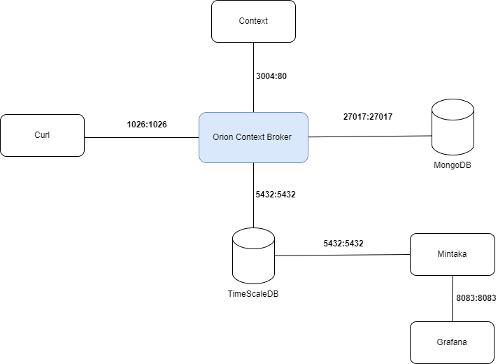

# Analytics and Monitoring for Gardens using NGSI-LD with Grafana
## Description
This mini project aims to provide analytics and monitoring capabilities for gardens using **NGSI-LD** and Grafana. It enables the storage and visualization of garden-related data such as soil moisture and soil temperature to facilitate the management and maintenance of green spaces.
This project is a simulation for managing and maintaining green spaces in Sup'Com.

NGSI-LD is an information model that simplifies sharing, querying, and subscribing to **context data**. 
It's used in smart cities, industries, agriculture, the Internet of Things, cyber-physical systems, and digital twins.

## Getting started

This project relies on [ngsild-grafana-datasource](https://github.com/bfi-de/ngsild-grafana-datasource), a Git plugin designed for Grafana, facilitating the integration of an NGSI-LD datasource. To begin, ensure to follow the steps outlined in this link.

## Smart data model 
In this project, we utilize the [dataModel.ParksAndGardens](https://github.com/smart-data-models/dataModel.ParksAndGardens) to represent parks, gardens, and associated green spaces within a city.

## Architecture


## Query configurations
The sample scenario included in this repository comes with four sample dashboards which can be used as templates.

### Standard gauge visualization

This enables us to visualize soil moisture pressure and soil temperature while ensuring comparison across different points and controlling them through a threshold system.


### Bar visualization

This allows us to visualize soil temperature while ensuring comparison across various points and regulating them using a threshold system set at 25°C.


### Current values

Queries for retrieving the current value of an attribute are also supported, accomplished by selecting the current value query type. This allows us to visualize the date of the last watering.


### Map visualization

Map visualizations can be realized by means of *geo* queries, and the Grafana Geomap panel type. 
Entities matching the selected filter conditions will be shown as markers on the map, enabling us to locate the devices (points).
 


## Folder structure

```
|-- datasource 
       |-- plugin:   Source code of the datasource
       |-- volumes:  Preconfigured Grafana configs (datasource, dashboards) for the sample scenarios
|-- smartModel:      Data model for the sample scenarios
|-- screenshots:     Screenshots
|-- volumes:         IDM/Keyrock configuration for the authentication scenario
```
## License

Apache 2.0
